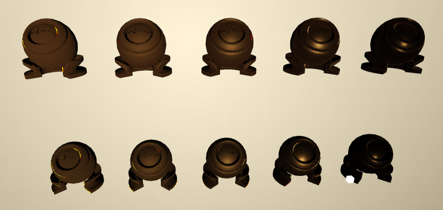

### 作业1 Notes
产生 shadow map 时，一般平行光用正交投影，而点光源用透视投影

泊松圆盘采样效果远好于随机圆盘采样，视觉上的噪声小了很多

PCF 为了实现软阴影，不仅考虑当前点是否被阻挡，还考虑当前点周围的点是否被阻挡了，这样算出一个平均的 visibility 值。那么第一个问题就是如何去寻找周围点，要确定该点所在模型上的周围点是有一些困难的。一个简单的近似是，考虑该点在 shadow map 上的周围点，在 filter radius 较小时，我们近似地认为这里的点就是模型上的周围点。然后采样得到的深度和中心点的实际深度去比，如果这个深度加上一个 bias 还要比中心的实际深度小（这里中心的实际深度减去 bias 可以理解为是我估计的采样点的实际深度的下限）就说明该采样点被遮挡了。这里的 bias 可以正比于中心点法线和光线方向夹角的正弦值（因为夹角越大，这里的深度变化越快），关于 bias 的选择可参考 [自适应Shadow Bias算法](https://zhuanlan.zhihu.com/p/370951892)

PCSS 可以理解为一个自适应的 PCF，从半影的成因出发，自动地选择当前渲染点合适的 PCF 的采样半径（阴影离遮挡物越远，光源面积越大，则半影现象越明显，越应该采用更大的采样半径）。具体来说，针对正交投影，采样半径 $r$ 定义为
```math
r = \frac{luv*(zr - zb)}{zb}
```
其中 $luv$ 是是光源在纹理空间中的半径，即它为光源的半径除以 shadow map 的分辨率，而 $zr$ 是渲染点到光源的距离，$zb$ 是渲染点的阻挡物到光源的距离（这些距离是在世界坐标中），计算 $zb$ 时会在 shadow map 上对渲染点和周围区域进行采样，来计算 $zb$ 的平均值（需要计算 $zb$ 的平均值而不是只使用渲染点在 shadow map 上的深度，是因为半影区域可能不会被产生 shadow map 的光源点遮挡，因此需要找找它周围被产生 shadow map 的光源点遮挡的位置）

而对于透视投影，采样半径定义为
```math
r = \frac{luv*(zr - zb)}{zb} * \frac{znear}{zr}
```
这里 $znear$ 是指产生 shadow map 时选择的近平面到光源点的距离，这里额外的修正来源于透视投影到近平面上时会改变边的宽度（而正交投影则不会），见 [GAMES202-作业1：实时阴影](https://zhuanlan.zhihu.com/p/595039591) 中评论区的讨论

我在实现时使用了固定的 5x5 的 blocker search area，但在 [GAMES202-作业1：实时阴影](https://zhuanlan.zhihu.com/p/595039591) 以及 [Nvidia PCSS Integration](https://developer.download.nvidia.cn/whitepapers/2008/PCSS_Integration.pdf) 中使用了根据光源大小和渲染点到光源的距离的启发式公式 radius = light_size_uv * (zReceiver - NEAR_PLANE) / zReceiver，这个基本的想法就是说，所有 blocker 可能的位置的总共面积，就是面积光源在近平面上的投影面积（以渲染点为中心），然后再除以纹理分辨率就得到了需要采样的面积。注意，这些相似关系的计算都需要在线性的世界坐标系中进行

TODO：如何生成面积光源的 shadow map
### 作业2 Notes
#### 矩形的面积投影
需要分别计算 cubemap 表示的环境光以及具有解析表达式的 brdf 的球谐系数，也就是需要计算它们与球谐函数乘积在球面上的积分。在作业 2 中，前者使用黎曼和估计，后者使用蒙特卡洛采样进行估计。使用黎曼和进行估计的想法是这样的，纹理上每个 texel 对应的面积就是黎曼和取微元立体角的粒度。我们假设位于 $(x,y)$ 的 texel 方块面积在单位球上的投影面积为 $f(x,y)$，那么我们有
```math
c_i = \sum_{x,y} SH_i(\vec{d_{xy}})tex(x,y)f(x,y)
```
其中 $c_i$ 是待求解的球谐系数，$\vec{d_{xy}}$ 是该 texel 的方向向量，而 $SH_{i}(\vec{d_{xy}})$ 则表示第 $i$ 个球谐函数在该方向上的取值。现在的问题变为如何计算一个方块在单位球上的投影面积，或者说计算这个方块相对于原点的立体角。根据二维前缀和的思路，我们可以把计算这个方块的投影面积转化为计算一个长为 $x_0$，宽为 $y_0$，并且一个顶点位于 $(0,0,1)$ 的矩形的投影面积（当然，这个矩形与 xy 平面平行）。根据立体角的定义，这个投影面积可以表示为
```math
S = \int_0^{y_0}\int_0^{x_0} \frac{1}{(x^2+y^2+1)^{\frac{3}{2}}}dxdy
```
通过 wolframalpha 我们注意到 
```math
\displaylines{
S = \int_0^{y_0} dy \left. \frac{x}{(y^2+1)\sqrt{y^2+1+x^2}} \right|^{x_0}_{0} = \int_0^{y_0} \frac{x_0}{(y^2+1)\sqrt{y^2+1+x_0^2}}dy \\
= -\left. tan^{-1}(\frac{-y\sqrt{x_0^2 + y^2 + 1} + y^2 + 1}{x_0})\right|^{y_0}_0 = tan^{-1}\frac{x_0 y_0}{\sqrt{1+x_0^2 + y_0^2}}
}
```
最后一步使用了正切函数的和角公式来合并两个用反正切定义的角度。这就是作业 2 的 `CalcPreArea` 函数的由来。[Solid Angle of a Rectangular Plate](https://rxiv.org/pdf/2001.0603v1.pdf) 中也是通过积分爆算得到了这个结果。不过工口怪想到了一个更简单的几何方法，根据 [球面三角形的面积公式](https://zhuanlan.zhihu.com/p/97346034)，计算投影到球面上的球面四边形各个球面角的大小即可，而计算这个球面角又相当于计算平面夹角。稍微用平面法向量的点乘算一下余弦结果就出来的
#### 球谐系数的旋转
根据 [Spherical Harmonic Lighting: The Gritty Details](https://3dvar.com/Green2003Spherical.pdf)，我们知道
* 球谐函数具有旋转不变性：若有三维旋转矩阵 $R$ 和定义在单位球面上的函数 $f(w)$，记使用前若干阶球谐函数对 $f(w)$ 的近似为 $\widetilde{f}(w)$，记 $g(w) = f(R(w))$，那么有 $\widetilde{g}(w) = \widetilde{f}(R(w))$
* 任意一球谐函数 $y(w)$，它在 $R$ 作用下的旋转 $y(R(w))$ 可由同阶的球谐函数的线性组合得到

设我们对光源的球谐投影表达为 $L(w) \approx \sum_{i}L_i y_i(w)$，给定一个旋转矩阵 R，根据上面的性质，我们有
```math
L(R(w)) \approx \sum_{i}L_i y_i(R(w)) = \sum_{i}L_i \sum_{j}m_{ij}(R)y_j(w) = \boldsymbol{L}^T M(R) \boldsymbol{y}(w)
```
其中 $M(R)$ 是一个仅依赖于 $R$ 的矩阵，因为球谐函数的旋转可由同阶的球谐函数的线性组合得到，因此我们还知道 $M(R)$ 是一个分块对角矩阵。新的 $L(R(w))$ 的球谐系数由 $\boldsymbol{L}^T M(R)$ 给出，其中 $L^T$ 是原球谐系数组成的行向量。这解释了 [手把手教你写GAMES202作业](https://zhuanlan.zhihu.com/p/596050050) 中球谐系数应该右乘 $M(R)$，而不是左乘

另外需要小心的一点是，在给环境光施加一个旋转矩阵 R 后，新的环境光应该是 $L(R^{-1}(w))$，而不是 $L(R(w))$
#### 间接光预计算
主要的实现参考的是 [Spherical Harmonic Lighting: The Gritty Details](https://3dvar.com/Green2003Spherical.pdf) 中的伪代码。大概思路是这样，我们要计算第 k 次弹射的间接光对点 p 的着色贡献，则有
```math
L_k(p) = \int max(\boldsymbol{n_p}\cdot w, 0)(1-V(p,w))L_{k-1}(Q(p,w))dw
```
这里 $Q(p,w)$ 表示在 $p$ 点向 $w$ 方向发出射线与场景的交点。我们在球面上均匀地选取 n 个采样点，根据蒙特卡洛积分有
```math
\displaylines{
L_k(p) \approx \frac{4\pi}{n}\sum_{i=1}^n max(\boldsymbol{n_p}\cdot w_i, 0)(1-V(p,w_i))L_{k-1}(Q(p,w_i)) \\
\approx \frac{4\pi}{n}\sum_{i=1}^n max(\boldsymbol{n_p}\cdot w_i, 0)(1-V(p,w_i))\sum_j T_{j,k-1}(Q(p,w_i)) L_j \\
= \sum_{j} T_{j,k}(Q(p,w_i))L_j

}
```
$T_{j,k}(p)$ 表示 $p$ 点在计算第 k 次弹射的光源贡献的着色贡献时的 radiance transfer 的球谐系数。其中 $T_{j,0}(p)$ 就表示 p 点在不考虑弹射时的 radiance transfer 的球谐系数，$L_j$ 表示环境光的球谐系数。这里的推导告诉我们，可以通过蒙特卡洛采样，可以从第 k-1 次弹射的 radiance transfer 的球谐系数，估计出第 k 次弹射的 radiance transfer 的球谐系数。最终 p 点的 radiance transfer 的球谐系数可以表示为
```math
T_j(p) = \sum_{k=0}T_{j,k}(p)
```
另外的一些细节
* albedo 我取的 0.5
* 结果记得做 gamma 矫正，否则看起来很暗
* 在 WelGLRenderer.js 中动态修改光源对应的球谐系数，否则切换环境光时着色不会发生变化
## 作业3 Notes
作业框架在 Linux 系统上渲染出现了 z-fighting 现象。有两种解决方法
* 使用 reverse-z 投影矩阵。但这个改起来稍微麻烦一点
* 增大近平面距离 $n$（缩小远平面距离 $f$ 并不是特别有效）

为什么增大近平面距离 $n$ 是有效的呢？从投影矩阵对深度值的变换可以看出（以右手系为例）
```math
z_{ndc} = \frac{f+n}{f-n} + \frac{2fn}{f-n}\frac{1}{z_{view}} \approx \frac{f+n}{f-n}+\frac{2n}{z_{view}}
```
其中 $f$ 和 $n$ 是远近平面的距离，最后一个约等于来源于通常 $f$ 是远大于 $n$ 的。因此当 $n$ 增大时，两个不同的 $z_{view}$ 被映射到的 $z_{ndc}$ 的间隔也等比例地增大，有助于缓解 z-fighting

给定法线构建一个正交坐标系的 `LocalBasis` 函数出自 [Building an Orthonormal Basis, Revisited](https://graphics.pixar.com/library/OrthonormalB/paper.pdf)

采样到新的方向后，不步进光线马上比较深度会出现噪点（当前位置被当作新的 hit point），一些解决办法有
* [手把手教你写GAMES202作业3: Screen Space Ray Tracing](https://zhuanlan.zhihu.com/p/599842851) 中的解决办法是在深度比较时加一个 bias，要求当前深度大于 bias 加上 gbuffer 深度才认为 hit 了
* 先步进一段初始距离再进行深度比较
* 或者沿着法线先偏移一点

方法 1 和 2 会在观察角度与平面几乎平行时出问题，我觉得原因在于此时光线步进时投影到 NDC 空间中后 x,y 坐标变化很小，主要是深度有变化，导致它又认为和步进的出发点附件的位置相交了（还是得在屏幕空间中步进才靠谱）。方法 3 不适用于单面材料，因为单面材料只有一个方向的法线，渲染另一个面是会误判法线方向的

另外就是切换洞穴场景时还需要切换摄像机和光源参数，不然会感觉渲染结果很暗

最后需要说的是 SSR 导致的阴影和漏光这两个 artifacts


导致阴影的原因在于一部分反射光线步进到屏幕外边去了，因此没有 radiance 贡献。把摄像机拉远，将平面完整地包括在屏幕中，就会发现阴影消失了


产生漏光的原因是反射光线实际击中的 cube 面没有出现在平面中，导致误认为反射光线击中了 cube 上边的面，贡献了不该有的 radiance。如果调整摄像机视角，将反射光线实际击中的 cube 面显示出来，就会发现漏光现象消失了
## 作业4 Notes
GGX 重要性采样已经在 [Microfacet-Theory-and-Torrance-Sparrow-BRDF](https://ckf104.github.io/posts/Microfacet-Theory-and-Torrance-Sparrow-BRDF), 因此 assignment pdf 中使用的重要性采样，就等价于在椭圆上做均匀采样，然后沿着法线取与椭球的交点，交点的法线即为采样得到的微表面法线。我们可以具体推导一下。首先做线性变换 $p^\prime = Ap$，将椭球变为球，然后圆盘上的均匀采样使用变换
```math
\displaylines{
x = \sqrt{a}cos(2\pi b) \\
y = \sqrt{a}sin(2\pi b)
}
```
最后取法线修正矩阵把球面上的法线变换为椭圆上的法线即可，计算可知这个法线与 assignment pdf 中的公式一致

另外，根据 [Revisiting Physically Based Shading at Imageworks
](https://fpsunflower.github.io/ckulla/data/s2017_pbs_imageworks_slides_v2.pdf) 的修正，$f_add$ 项需要多乘一个 $F_avg$


产生上图中的亮点的原因在于 `GeometrySmith` 函数中计算点积时没有将负值 clamp 到 0，这导致两个 G1 项相乘，负负得正，原来应该为黑色的点就变亮了。在计算 `NoV` 和 `NoL` 时将其 clamp 到 0 就好了
```glsl
    float NoV = max(dot(N, V), 0.0);
    float NoL = max(dot(N, L), 0.0);
```
